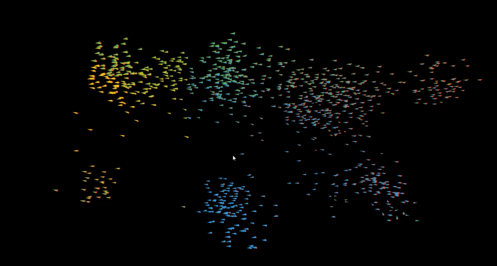

# badboids

boids

## Just a little flocking demo to play with defining simple 3d models, and drawing them.
* simple controls right mouse, then left-right  to rotate around the boid box or hold shift to zoom in (up) or out (down)
* hold the spacebar to anti-flock



Model definition looks like this:
```
class Wedge extends Model {
  List getModel() {
    return makeModel([
      [
        Colors.red,
        [
          [-2, 0, 0],
          [2, 0, 0],
          [0, 2, 0]
        ]
      ],
      [
        Colors.green,
        [
          [-2, 0, 0],
          [2, 0, 0],
          [1, 1, -6]
        ]
      ],
      [
        Colors.amber,
        [
          [-2, 0, 0],
          [0, 2, 0],
          [1, 1, -6]
        ]
      ],
      [
        Colors.blue,
        [
          [2, 0, 0],
          [0, 2, 0],
          [1, 1, -6]
        ]
      ]
    ], false);
  }
}
```
